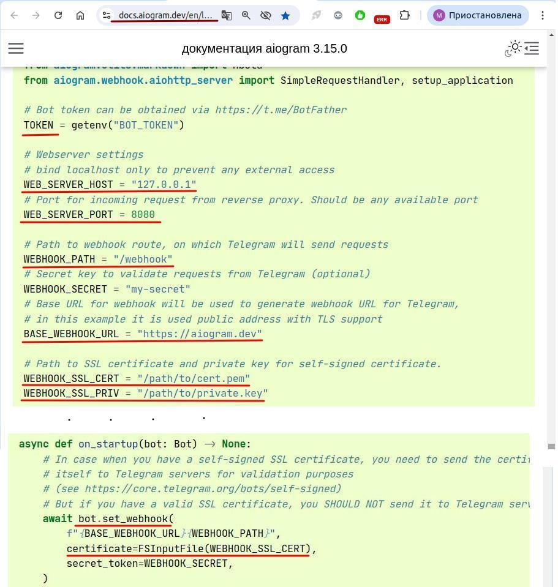
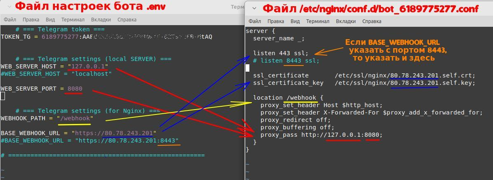
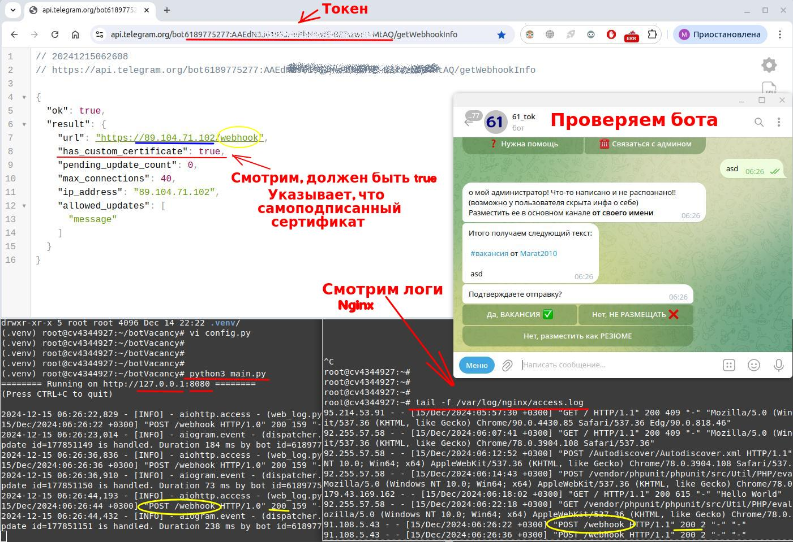

## Ручной деплой бота на VPS.

### Случай в связки с Nginx и самоподписанным сертификатом на IP адрес  

---


1. **Клонируем своего бота с гита:**  

	`git clone https://gitlab.com/__/___.git`  
	`git clone https://github.com/___/____.git`  

    >Переходим в папку куда развернули.  
	Проверим версию Python:   `python3 -V`  
   
	>Устанавливаем пакеты для установки окружения, если нет:  
	`sudo apt update`  
	`sudo apt install python3-venv`  
    	или так (иногда нехватает библиотек):  
	`sudo apt install -y build-essential libssl-dev libffi-dev python3-dev`  
	
	>Создаем новое виртуальное окружения:  
	`python3 -m venv .venv`	(«.venv» — каталог окружения)  
	
	>Активируем окружения:  
	`source .venv/bin/activate`  
	
	>Разворачиваем пакеты (из requirements, или poetry, ...):    
	`pip install -r requirements.txt`  

2. **Установим обратный прокси сервер Nginx (если нет):**  
	`sudo apt install nginx`  
	`sudo systemctl enable nginx`	(добавим в автозагрузку)  
	`sudo service nginx status`		(проверим статус)  


3. **Настраиваем параметры своего бота (либо в основном файле, либо «.env»)**  

	Параметры бота взяты с примера (версия 3.15.0 на текущий момент):  
	https://docs.aiogram.dev/en/latest/dispatcher/webhook.html (Рис.1)

	
   3.1. Указывает свой токен: **TOKEN = хххxxx:ууу…….уууу**  

   3.2 Хост оставляем так или «localhost»:

		WEB_SERVER_HOST = "127.0.0.1"  

   3.3 Порт можно выбрать любой незанятый:

		WEB_SERVER_PORT = 8080
	
   3.4 Путь указываем любой, этот путь потом пропишем в настройках Nginx. 
	    Например, если будет несколько ботов, можно «/bot_1», для второго «/bot_2», и т.д.:

		WEBHOOK_PATH = "/webhook"								

   3.5 Указываем внешний IP адрес VPS:

		BASE_WEBHOOK_URL = "https://80.78.243.201"  

   Можно указать с другим портом (8443) "https://80.78.243.201:8443" , для того чтобы 
   не мешался, если на Nginx, крутиться какой-то вебсервер.

   По адресу https://80.78.243.201/webhook (BASE_WEBHOOK_URL+WEBHOOK_PATH) телеграм 
   сервер будет слать сообщения для бота. Nginx по данному пути (/webhook) будет
   перехватывать их, и пересылать на локально запущенный бот по 
   адресу http://127.0.0.1:8080 (WEB_SERVER_HOST:WEB_SERVER_PORT)

 **Рис. 1**

   3.6 Указываем пути для серификатов SSL (позже их создадим):  

	    WEBHOOK_SSL_CERT = "/etc/ssl/nginx/80.78.243.201.self.crt"  
	    WEBHOOK_SSL_KEY = "/etc/ssl/nginx/80.78.243.201.self.key"  

   В именах сертификата указываем IP адрес (80.78.243.201) для удобства,
   «self» тоже для удобства, означающий, что сертификат самоподписанный.

   3.7 Самоподписанный сертификат, мы должны указать в установке вебхука.  
	    В **await bot.set_webhook** должен быть параметр:  

		certificate=FSInputFile(WEBHOOK_SSL_CERT),  

Запуск с бота с "**ssl_context**" в функции "**def main**" не нужен, поэтому эти данные **НЕ вносим**:  

~~# Generate SSL context~~
~~context = ssl.SSLContext(ssl.PROTOCOL_TLSv1_2)~~\
~~context.load_cert_chain(WEBHOOK_SSL_CERT, WEBHOOK_SSL_PRIV)~~\
~~# And finally start webserver~~\
~~web.run_app(app, host=WEB_SERVER_HOST, port=WEB_SERVER_PORT, ssl_context=context)~~\

4. **Готовим самоподписанные сертификаты и ключи SSL:**  

	>Создаем каталог в **/etc/ssl**:  
	`dir /etc/ssl/nginx`

	>Запускаем команду (IP адрес меняем на свой):  
	`openssl req -newkey rsa:2048 -sha256 -nodes -keyout /etc/ssl/nginx/80.78.243.201.self.key -x509 -days 365 -out /etc/ssl/nginx/80.78.243.201.self.crt -subj "/C=RU/ST=RT/L=KAZAN/O=Home/CN=80.78.243.201"`  

	В каталоге **/etc/ssl/nginx/** сформируются два файла.


5. **Готовим Nginx сервер**

    >5.1. Переходим в каталог настроек для Nginx: `cd /etc/nginx/conf.d/`  
	В этом каталоге будет храниться файл для переадресации Nginx на нашего бота.
	
    >5.2. Создадим файл например **bot_6189775277.conf**, где *6189775277** — id бота (начало токена), и поместим 	следующее:

	```
	server {
	  server_name _;

	  listen 443 ssl;
	  # listen 8443 ssl; 

	  ssl_certificate       /etc/ssl/nginx/80.78.243.201.self.crt;
	  ssl_certificate_key   /etc/ssl/nginx/80.78.243.201.self.key;	

	  location /webhook {
	    proxy_set_header Host $http_host;
	    proxy_set_header X-Forwarded-For $proxy_add_x_forwarded_for;
	    proxy_redirect off;
	    proxy_buffering off;
	    proxy_pass http://127.0.0.1:8080;
	  }
	}
	```
	Взаимосвязь параметров между настройками бота и конфигурации Nginx:

 **Рис. 2**  

   >5.3. Перезапустим Nginx:  `systemctl restart nginx.service`  (Иногда: + `systemctl daemon-reload`)  
   Можно проверить статус: `systemctl status nginx.service`

   >5.4. Переходим в каталог проекта и запустим бота: `python3 main.py`

   >5.5. Проверяем бота. Состояние можно проверить по адресу:  
	`https://api.telegram.org/bot6189775277:AA…..AQ/getWebhookInfo`  
	где после слова bot вставить свой токен (6189775277:AA…..AQ)  

   >Посмотреть логи Nginx: `tail -f /var/log/nginx/access.log`  

 **Рис. 3**  

---

### Дополнение.

В случае запуска бота через FastAPI (случай Святослава) **WEB_SERVER_HOST**  и **WEB_SERVER_PORT** 
будут зависеть от того, как запускается FastAPI:  
	`uvicorn main:app --host 127.0.0.1 --port 8000`

Потому как ручки (**webhook_path = '/webhook'**) дергаются через FastAPI.  
В настройках Nginx: `proxy_pass http://127.0.0.1:8000;`  
В настройках Nginx: `location /webhook`

При запуске: `uvicorn main:app --host 0.0.0.0 --port 8000`, в этом случае FastAPI (swagger) доступен
из вне по порту 8000, по внешнему адресу даже без Nginx.  
Для доступа через Nginx в настройках Nginx **proxy_pass** указывать **127.0.0.1** или **localhost**.
	
Также самоподписанный сертификат, мы должны указать в установке вебхука.  
В **await bot.set_webhook** должен быть параметр:  
		`certificate=FSInputFile(WEBHOOK_SSL_CERT),`

 
---

