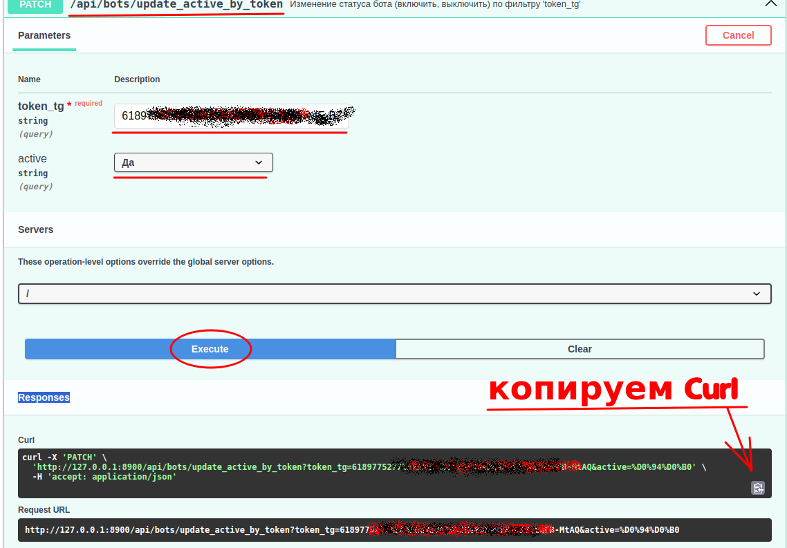
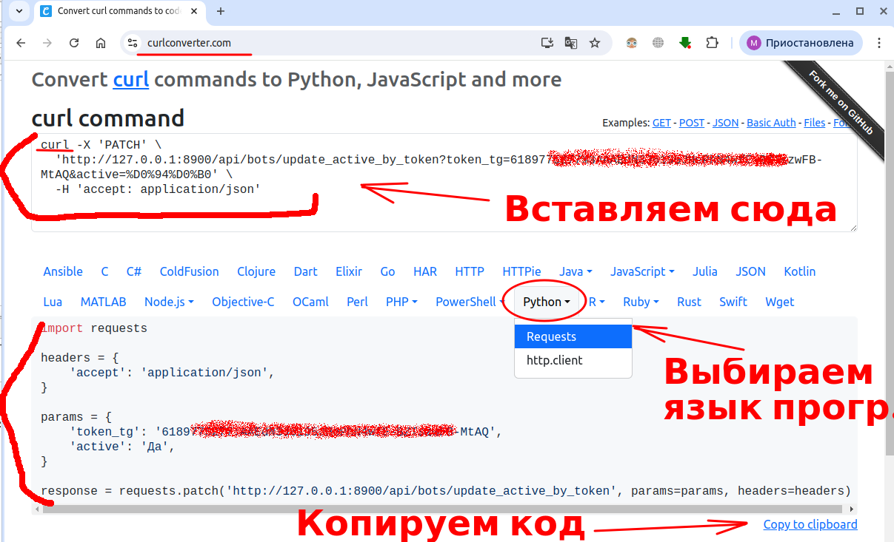

# === В РАЗРАБОТКЕ !!! ===
### === Необходимо проверить на VPS!!! ===

---

## Система управления ботами - СУБота&#169; 😊
### API - Менеджер ботов СУБота©️  (manageBots)
### (FastAPI+Aiogram3+Webhook+SSL на VPS/VDS): 

<u>***!!! Осторожно, скрипты могут затереть ваши файлы!!!***</u>  
<u>***Предполагается установка на вновь созданный сервер!***</u>  

---
### Описание
Полный цикл работ по размещению СУБотами на Aiogram3 c webhook, SSL на VPS/VDS.  
Система управления реализовано на API FastAPI, БД SQLite (возможно использовать любую СУБД - использована библиотека SQLAlchemy)  
Проверено на ОС серверов .... Timeweb, Рег.ру:  Ubuntu 20.04, Ubuntu 22.04.

1. Подключаемся к серверу `ssh root@xxx.xxx.xxx.xxx` и выполняем последовательно все команды.    

2. Скачиваем и запускаем первый скрипт, выполним команду:  
    ```
    wget -O ./0_prepare.sh https://raw.githubusercontent.com/Marat2010/manageBots/v2_1/Scripts/0_prepare.sh && chmod +x 0_prepare.sh && ./0_prepare.sh
    ```
   Скрипт подготовить все, для запуска менеджера ботов: 
   - скачает репозиторий
   - установку и настройку nginx
   - установку вирт.окружения, пакетов apt, пакетов из requirements.txt
   - необходимые скрипты.
   - ...

3. В конце выполнения скрипта будут предоставлены ссылки для входа в API (swagger).
4. Добавляем бота в разделе "Manage Bots" -> "/api/bots/add_bot" -> "Try it out".  
   В "Request body" указываем токен, подставляем вместо "string":
   ```
   {
       "token_tg": "6xxxx:AAEdN...............tAQ"
   }
   ```
   Чуть ниже жмём на "Execute", в разделе "Responses" увидим ответ в формате json.  
   Шаблонный бот запустится.
5. В проекте "manageBots" в папке "our_Bots" сформируется папка вида "bot_<номер порта>",
  где <номер порта> - "web_server_port" в нашем полученном json ответе.
6. В папке "bot_<номер порта>" хранится шаблон для бота, куда необходимо скопировать 
  вашего бота и настроить с Polling-а на вебхук.  
   Настройка идет минимальная, необходимо только убрать Poling, все значения задаются в 
  файле "config_bots", который настроен на получение из базы данных (файл ./DB/manbot.sqlite3).
7. Далее, необходимо перезапустить бота через API (Swagger)  
  -> Раздел "Manage Bots by web_server_port" 
  или "Manage Bots by token_tg"  
  -> "/api/bots/update_active_by_port" или "/api/bots/update_active_by_token"  
  -> указываем либо порт на котором крутится бот(функционал бота), либо токен ТГ.  
  -> выставляем "active" сначала в "Нет", потом в "Да" для запуска бота.
   
Аналогичным образом добавляются следующие боты (переводятся с Polling-а).

Дальнейшая работа, будет заключаться в остановке и включении бота (active) в API, добавлении и удалении ботов.
При удалении ботов, в папке "./our_Bots/Archive/" создается архив удаленного бота такого 
вида: <bot_9001_26-09-2024_02:56:55.tar.gz>.

### Доп.инфо
Для формирования своей системы управления ботами на "фронте" (web), можно использовать "curl", 
который формируется в swagger в ответе "Responses"  



Далее через сайт конвертер (например: https://curlconverter.com/python/) перевести его в код 
на любой язык программирования.




---
 
### Продолжение возможно будет ....
Пока не делал связку "Owner" с ботами, сама таблица создана.  
Необходимо определиться ManyToMany или OneToMany ....
Или вообще не делать, возможно "Owner" будет формироваться в другом месте на фронте 
или привязываться в другой системе.
\
\
\
<br>
&nbsp;&nbsp;&nbsp;&nbsp;©Marat2010


